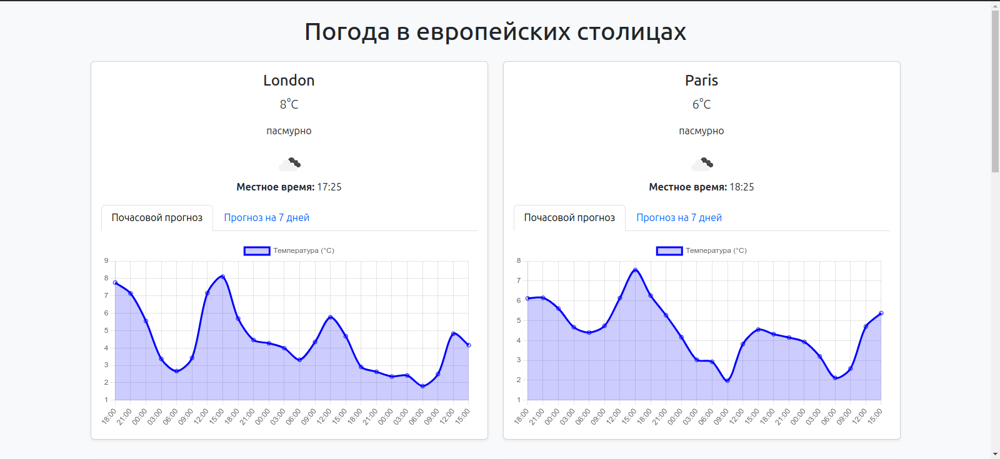
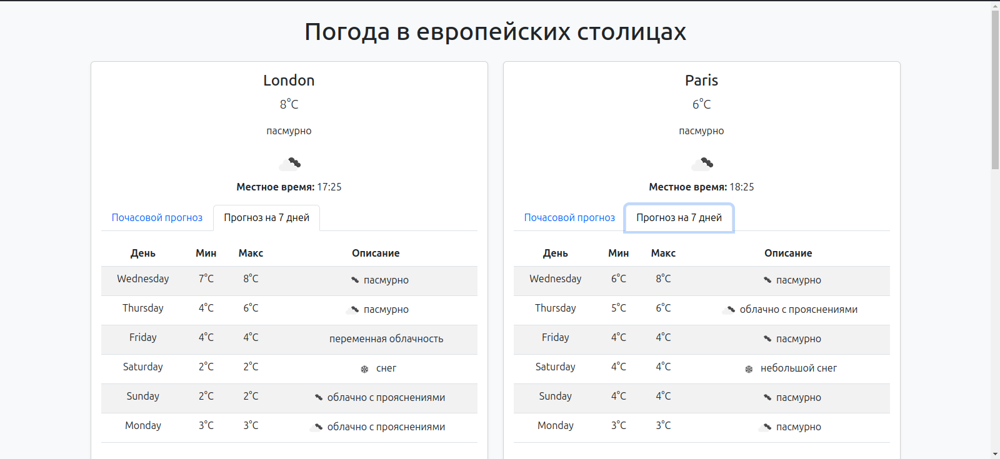

---

# Погода в европейских столицах 🌍🌦️

Этот проект позволяет отображать актуальную погоду в европейских столицах. Он предоставляет почасовой и 7-дневный прогноз погоды для городов, таких как Лондон, Париж, Берлин, Рим, Москва и Амстердам.

## Описание

Сайт показывает текущую погоду, а также почасовой и долгосрочный прогноз для нескольких европейских городов. Прогнозы обновляются регулярно с использованием данных из [OpenWeatherMap API](https://openweathermap.org/api).

### Особенности:
- **Текущая погода** для каждого города.
- **Почасовой прогноз** на ближайшие 24 часа.
- **7-дневный прогноз**, включая минимальные и максимальные температуры и описание погодных условий.
- **Поддержка локального времени** для каждого города.
- **Актуальные погодные иконки**.

## Как использовать

### 1. Установка зависимостей

Для начала вам нужно установить зависимости. Перейдите в директорию проекта и выполните следующую команду:

```bash
pip install -r requirements.txt
```

### 2. Создание .env файла

Создайте файл `.env` в корне проекта и добавьте ваш `API_KEY` от OpenWeatherMap:

```
TOKEN=your_openweathermap_api_key
```

### 3. Запуск проекта

После того как все зависимости установлены, и файл `.env` настроен, запустите сервер:

```bash
python manage.py runserver
```

Проект будет доступен по адресу: [http://127.0.0.1:8000](http://127.0.0.1:8000)

## Скриншоты

Пример того, как выглядит сайт:

### Главная страница:


### Прогноз на 7 дней:


## Структура проекта

- **weather/** - основной код для работы с погодными данными.
  - **models.py** - описание модели для хранения информации о погоде.
  - **views.py** - отображение данных о погоде на сайте.
  - **templates/** - HTML-шаблоны для отображения информации.
- **.env** - файл конфигурации с вашим API-ключом.
- **requirements.txt** - файл с зависимостями проекта.

## Используемые технологии

- **Django** - для разработки веб-приложения.
- **requests** - для работы с API OpenWeatherMap.
- **pytz** - для работы с часовыми поясами.
- **Bootstrap** - для стилизации страницы.

---
